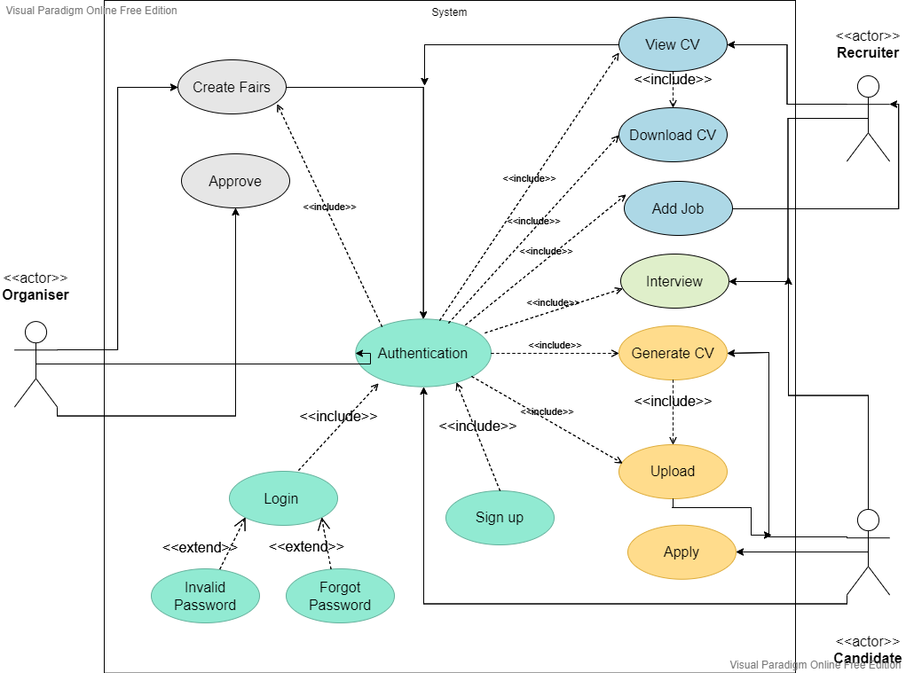

# Virtual Career Fair App
[This project](http://www.virtualcareerfairapp.webhoster.com.pk/) was displayed in UET'S Centennial Technovation Innovation Summit 2022 and made it to the list of honorary mentions. 

## Contents of this file
- [Project Description](#project-description)
- [Objectives](#objectives)
- [Scope](#scope)
- [Tech Stack](#tech-stack)
- [Usage](#usage)
- [Contributers](#contributers)
- [License](#license)

## Project Description
The essential goal of this application is to conduct and manage a Virtual Career Fair. This system is to handle the career fair program by connecting all the stakeholders, including organisers, companies and students. The Career Fair web application will allow students to have one-on-ones with recruiters and will end the need for career fair candidates to wait in long, ridiculous lines. This app is going to offer you a simulative virtual platform, where you can meet various recruiters and industry experts from the comfort of your homes and offices.

This project has four main parts:
- A database that will store all the data about the employers and candidates
- An administrative interface that would allow adding, removing, and editing information of the company and candidate
- An interface for employers where they can see the candidates who applied for the job, can exhibit their posters, and can upload the time slots they will be available at
- Candidates interface where they can apply for the job that matches their interests, upload resumes and can read an intro about the company

## Objectives
Due to the social distancing regulations in the current pandemic situation, organizing a physical career fair has become tedious and unrealistic. Hence our primary goal is to make a platform where virtual career fairs can be organized and conducted amidst the current situation in the country. The virtual nature will allow a broader community and will allow both companies, and candidates to participate in the event without any significant restrictions.

## Scope
This web-based application has been developed to connect the following stakeholders of the system.
- Students who are looking for a job placement/guidance.
- Companies who are willing to recruit new candidates
- Career fair organisers who are responsible for handling fair and who will facilitate the organizing of the event.

### The undergraduates and graduates of U.E.T. shall be able to
1. request to register for the career fair through the app before the career fair begins
2. virtually wait in multiple lines while they are speaking with a recruiter or preparing to
speak with their next recruiter.
3. select which companies they would like to see at the career fair as well as rank the
companies they would like to see
4. network with as many companies as possible, with their preferences being a priority.
5. get a notification once to be called for the meeting
6. add/remove companies or change their company rankings while the career fair is in
progress
7. upload their resumes to the app
8. view all advertisements for company vacancies

### The relevant companies shall be able to
1. request to register for the career fair
2. upload materials about the company and resources for candidates
3. upload advertisements for company vacancies
4. view candidate CVs
5. post the positions they are hiring for
6. add which recruiters will be attending the career fair

### The organisers shall be able to
1. upload information about the career fair they are hosting including which companies are
attending and the layout of the career fair
2. authorize companies and students requested who registration
3. view all registered companies and their profiles
4. view all registered candidates and their profiles/CVs

## Tech Stack
- [PHP](https://www.php.net/)
- [MYSQL](https://www.mysql.com/)
- [Bootstrap](https://getbootstrap.com)
- [JQuery](https://jquery.com)
- [HTML](https://code.visualstudio.com/docs/languages/html)
- [CSS](https://code.visualstudio.com/docs/languages/html)
- [JS](https://vuejs.org/)

## Usage
As seen in the use case diagram all the functionalities offered on the web application aew only applicable if you are logged in. You can log-in as a recruiter or as a student.
First you will create an account by signing-up.

  

- Recruiter Side

When a recruiter logs in, they will be redirected to their dashboard. They will be able to see all the fairs they have join on their dashboard. They can
edit, delete, update their profile. By clicking a specific career fair, they can post/add/delete/update jobs. They can view the candidates that have joined
that specific career fair. From that, there is an option to view/download the CV of a student and have one-to-one meeting by selecting a time slot.

- Student Side

A student will create their profile first (sign-up). When they will log-in, the page will be redirected to their dashboard.  They will be able to see all the fairs they have join on their dashboard. They can
edit, delete, update their profile. They can join the fairs, upload their CV or use the in-built feature to generate a CV. They can then view all the companies registered in
that specific career fair and apply for jobs.

- Organisers Side

An organiser will have a dashboard in where he can create, read, update, delete career fairs. The recruiter/student will send a request to the organiser to join a fair and
only when the organsier accepts the request, they can join a fair. The organziser will be sent notification each time someone sends a request for joining a fair. They can
create, read, update, delete their profile on their dashboard.

## Contributers
This project owes its completion to the sheer hard work and untiring efforts of the team members
- [Zainab Rizwan](https://github.com/zainab-rizwan)
- [Arooj Naeem](https://github.com/arooj-naeem)
- [Maryam Nasir](https://github.com/maryamnasir65834)
- [Sayyeda Asma](https://github.com/sayyedaasma)
- [Ushna Ijaz](https://github.com/ushnaijaz)
- [Saba Saeed](https://github.com/sabasaeed8)
- [Marriam Salman](https://github.com/marriamsalman)
- [Tayyaba Asif](https://github.com/tayyaba-asif)

## License
Distributed under the MIT License. See `LICENSE.txt` for more information.
